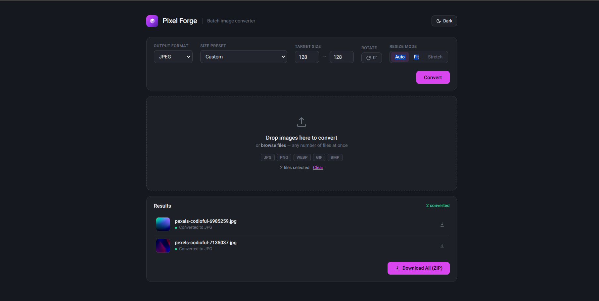
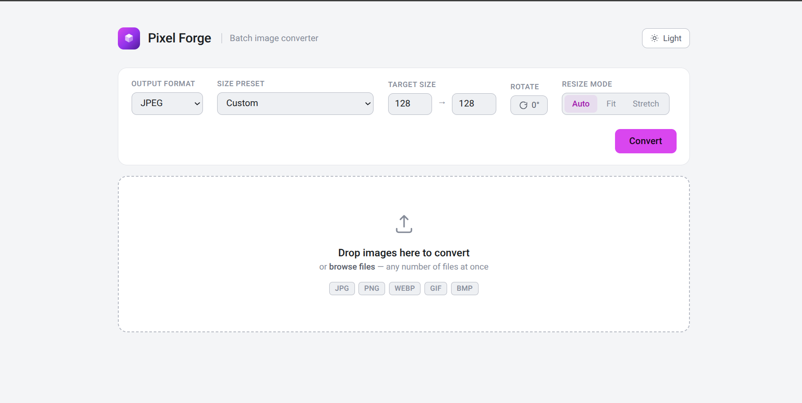
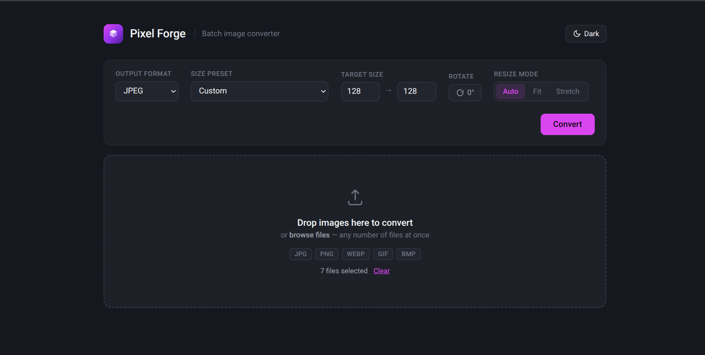
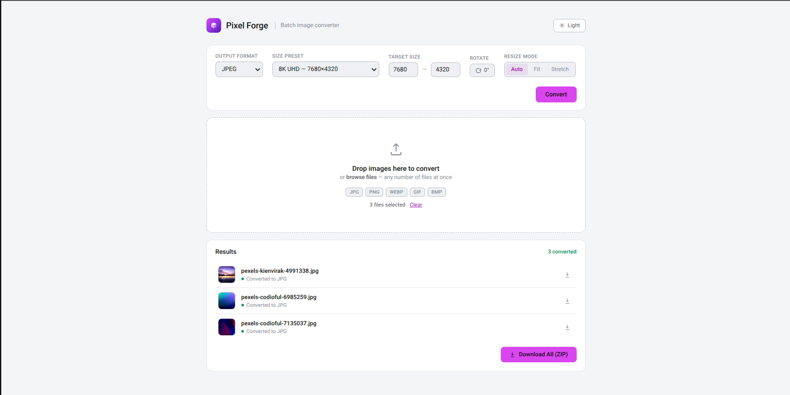
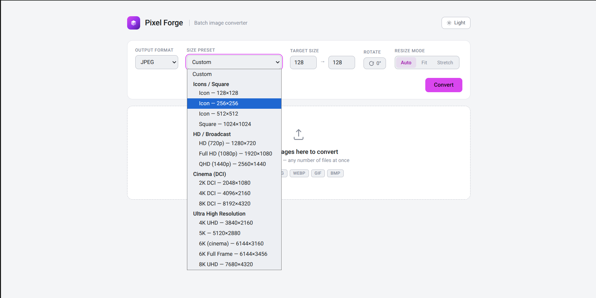
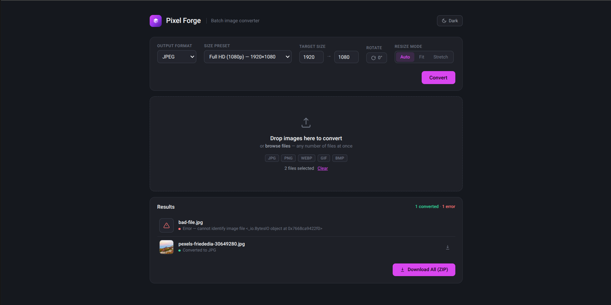
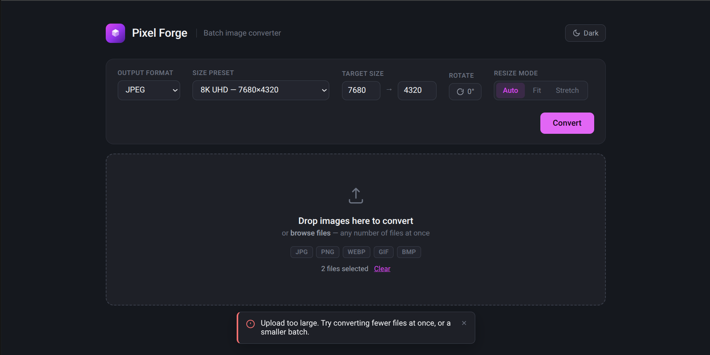

# Pixel Forge

A batch image format converter with a web interface. Drop in any number of
images, pick an output format, resize/rotate as needed, and get back
converted files individually or as a single ZIP.

Built as part of a portfolio series applying the [Google IT Automation with
Python](https://www.coursera.org/professional-certificates/google-it-automation)
methodology to real, testable software projects.




## Features

- **Convert between any format Pillow supports** — JPEG, PNG, WEBP, GIF, BMP,
  and more, not a fixed hardcoded list
- **Resize** with either **Fit** (preserves aspect ratio) or **Stretch**
  (forces exact dimensions), plus an **Auto** option for anyone unsure which
  to pick
- **Size presets** — common resolutions from icon sizes (128×128) up through
  8K DCI cinema (8192×4320), grouped by category
- **Rotate** in 90° increments
- **Batch-safe by design** — one corrupted or unreadable file in a batch of
  hundreds never crashes the whole run; it's skipped and reported with a
  clear, plain-language message (not a stack trace), and everything else
  still converts
- **Drag-and-drop or click-to-browse** file selection, additive (adding more
  files doesn't wipe out what you already selected)
- **Individual downloads** per converted file, or **Download All** as a ZIP
- **Dark/light theme**, persisted across visits, no flash of the wrong theme
  on reload

## Tech stack

Python, Flask, Pillow, vanilla JS (no frontend framework), pytest.

## Setup

Requires Python 3.10+.

### Linux / macOS

```bash
git clone https://github.com/Aayush29052006/Pixel-Forge.git
cd Pixel-Forge
python3 -m venv .venv
source .venv/bin/activate
pip install -e ".[dev]"
```

### Windows (PowerShell)

```powershell
git clone https://github.com/Aayush29052006/Pixel-Forge.git
cd Pixel-Forge
python -m venv .venv
.venv\Scripts\Activate.ps1
pip install -e ".[dev]"
```

## Running it

```bash
python run.sh
```

Then open **http://127.0.0.1:5050** in a browser. Port 5050 is used
deliberately instead of Flask's default 5000, to avoid clashing with other
local projects that may already be running on 5000.

## Running tests

```bash
pytest -v
```

38 tests across the conversion engine, the batch runner, and the web layer.

## Known limits

These aren't bugs — they're deliberate, sane defaults for a local
single-user tool:

- **~999 files per batch upload.** This comes from Werkzeug's built-in
  `MAX_FORM_PARTS` protection (1000 parts per request, where each file plus
  each form field counts as one part) — a security limit against malicious
  multipart requests, not something Pixel Forge imposes itself.
- **300 MB total upload size per batch**, configurable without touching
  code:
  ```bash
  PIXELFORGE_MAX_UPLOAD_MB=1000 python run.sh
  ```
- **Resizing upscales, but doesn't add detail.** Picking a target size
  larger than the source image (e.g. converting a 500×500 photo to 8K) will
  succeed, but the result is interpolated, not AI-upscaled — it'll look
  soft, not sharp.

## More screenshots

| | |
|---|---|
|  File selection before converting |  Light mode with results |
|  Size preset dropdown |  A batch with one success, one error |
|  Error notification | |

## Project structure

```
Pixel-Forge/
├── src/pixelforge/
│   ├── core.py              # pure conversion engine (bytes in, bytes out)
│   ├── batch.py              # batch runner: per-file error handling, summary report
│   └── webapp/
│       ├── __init__.py       # Flask app factory
│       ├── routes.py         # / and /api/convert, /api/convert/zip
│       ├── static/img/       # the one raster asset the app uses (error icon)
│       └── templates/
│           └── index.html    # the whole frontend: HTML/CSS/JS, no build step
├── tests/                    # pytest suite, synthetic images generated in-memory
├── design-reference/
│   └── mockup.html           # approved visual reference the real UI was built to match
└── run.sh                    # starts the dev server on port 5050
```

## License

MIT — see [LICENSE](LICENSE). This repository is kept private until after
graduation; the license governs the code itself regardless of repo
visibility.
